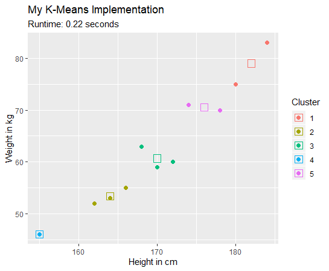

# My K-Means
A from-scratch implementation of the K-Means algorithm in R.
Done as an assignment for a course on data mining.
The data used for demonstration contains height and weight measures of a few (fictional) persons.

## Result
Color represents th assigned cluster. The small squares represent the cluster centroids.

